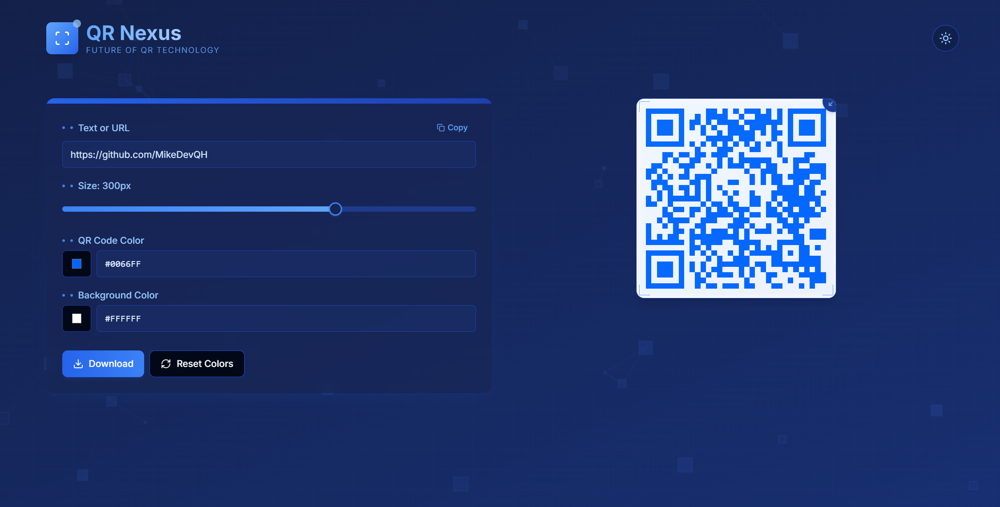

# 🚀 QR Nexus: Generador de Códigos QR Futurista  

QR Nexus es una aplicación web moderna y elegante diseñada para crear códigos QR personalizados con una estética futurista y minimalista. Desarrollada con las últimas tecnologías web, esta herramienta permite a los usuarios generar códigos QR con opciones avanzadas de personalización, ofreciendo una experiencia intuitiva y atractiva.  

## 🚀 Capturas de pantalla




## 📌 Características Principales  

### 🎯 Generación de Códigos QR  
- Entrada versátil: genera códigos QR a partir de texto, URL o números.  
- Alta calidad: nivel "H" de corrección de errores para máxima fiabilidad.  
- Previsualización en tiempo real de los cambios realizados en el código QR.  

### 🎨 Personalización Completa  
- Ajuste de tamaño mediante un control deslizante (100px - 400px).  
- Personalización de colores de los píxeles y del fondo.  
- Animaciones fluidas para expandir o reducir el código QR.  
- Botón de restablecimiento rápido a valores predeterminados.  

### 📤 Exportación y Compartición  
- Descarga en formato **PNG** de alta calidad.  
- Copiado rápido del texto o URL utilizado para generar el código QR.  

### 🌙 Experiencia de Usuario Mejorada  
- Cambio de **tema claro/oscuro** con transiciones suaves.  
- Animaciones elegantes para interacciones fluidas.  
- **Fondo dinámico animado** con partículas y líneas tecnológicas.  
- Diseño **100% responsivo** para móviles, tablets y escritorio.  

## 🛠️ Tecnologías Utilizadas  

- **Framework:** Next.js con App Router  
- **Lenguaje:** TypeScript  
- **Estilos:** Tailwind CSS  
- **Componentes UI:** ShadCN UI  
- **Generación de QR:** `qrcode.react`  
- **Gestión de Temas:** `next-themes`  
- **Animaciones:** Framer Motion  
- **Iconos:** Lucide React  

## 🔧 Instalación y Uso  

1. Clona el repositorio:  
   ```bash
   git clone https://github.com/MikeDevQH/Nexus-QR-Code-Generator.git
   cd qr-nexus
   ```
2. Instala las dependencias:  
   ```bash
   npm install
   ```
3. Inicia el servidor de desarrollo:  
   ```bash
   npm run dev
   ```
4. Abre en tu navegador:  
   ```
   http://localhost:3000
   ```

## 📌 Casos de Uso  

- **Marketing Digital:** QR personalizados para campañas publicitarias.  
- **Eventos:** QR para entradas, información o registros.  
- **Comercio Electrónico:** QR para productos, pagos o detalles adicionales.  
- **Educación:** Recursos interactivos mediante códigos QR.  
- **Restaurantes:** Menús digitales accesibles por QR.  
- **Tarjetas de Presentación:** Contacto digital elegante mediante QR.  

## 📜 Licencia  

Este proyecto está bajo la licencia **MIT**.  

## 🌎 Contribuciones  

¡Las contribuciones son bienvenidas! Si quieres mejorar QR Nexus, envía un **pull request** o abre un **issue** en GitHub.  

---

**✨ QR Nexus: La fusión perfecta entre funcionalidad práctica y diseño atractivo. ✨**
